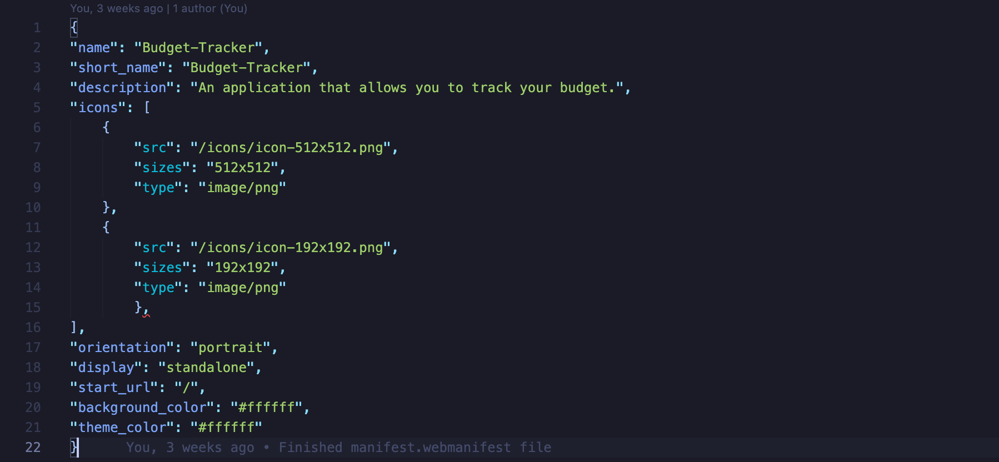

# Budget-Tracker

This app is a Budget tracker that allows a user to add expenses and deposits to their budget with or without a connection. When entering transactions offline, the total is populated when brought back online.

## User Story

AS AN avid traveller
I WANT to be able to track my withdrawals and deposits with or without a data/internet connection
SO THAT my account balance is accurate when I am traveling

## Business Context

Giving users a fast and easy way to track their money is important, but allowing them to access that information anytime is even more important. Having offline functionality is paramount to our applications success.

## Acceptance Criteria

GIVEN a user is on Budget App without an internet connection
WHEN the user inputs a withdrawal or deposit
THEN that will be shown on the page, and added to their transaction history when their connection is back online.

## Development

To begin, for this app to work, a service-worker file and manifest.webmanifest file needed to be created. The service worker file indicates which files to be cached, followed by the event listeners for the various actions taken, i.e.:

The webmanifest file was then created as shown below:

Next, the database (indexDB) file was created to handle adding and updating the transactions in sync with the databse:

Ultimately the end result is a budget tracker that also works offline and allows the user to still be able to save these transactions entered while offline. One issue encoutnered was the id_key being assigned to the transactions entered offline. This was resolved by assigning the assigned key to undefined, otherwise the key automatically assigned was not recognizable.

## Credits

* Web App Manifests - [Manifests](https://developer.mozilla.org/en-US/docs/Web/Manifest)

* Mongoose - [Mongoose](https://www.npmjs.com/package/mongoose)

* NPM Manifest - [NPM Manifest](https://www.npmjs.com/package/manifest)

## Links

GitHub Repository - [Budget Tracker App Repository](https://github.com/ktrudickm/Budget-Tracker "Budget Tracker")

Heroku - [Heroku Budget Tracker](https://fitness-workouttracker.herokuapp.com/?id=60a6dad535b9010015ee67bc)
